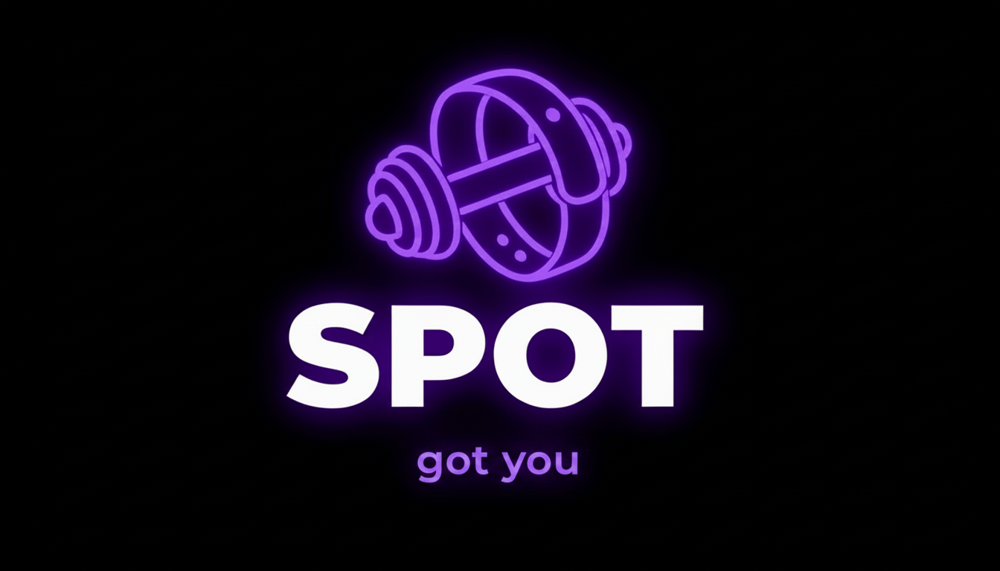

# SPOT — got you.

> AI-powered gym band that corrects your form in real time.



## What is Spot?

Spot is a smart fitness wearable concept that combines IMU and EMG sensors to track every rep, detect which exercise you're doing, and score your form in real time — giving you green, yellow, or red feedback so you always know if you're lifting correctly.

Built for people who train alone and can't always have a spotter or personal trainer. Spot is your gym buddy on your wrist.

---

## The Problem

Form correction is the number one reason people get injured or plateau in the gym. Personal trainers are expensive. Gym buddies aren't always available. No existing fitness band tracks form — they only track output like steps, heart rate and calories.

Spot fills that gap.

---

## How It Works

Spot uses three sensors:

- **IMU** (Accelerometer + Gyroscope) — detects movement patterns and classifies which exercise is being performed
- **EMG** (Electromyography) — reads muscle activation signals through the skin to detect which muscles are firing and whether form is breaking down
- **PPG** (Photoplethysmography) — reads heart rate and exertion level

The ML model compares your rep's signal in real time against the ideal form profile for that exercise and outputs a deviation score — mapped to green (good), yellow (okay) or red (bad form).

---
## Screenshots

| Dashboard | Active Session | Session Complete |
|---|---|---|
|  |  |  |

| History | Profile |
|---|---|
|  |  |


## Tech Stack

### Frontend
- React Native with Expo
- TypeScript
- expo-linear-gradient, expo-speech
- Supabase for auth and session storage

### ML Model
- Python 3.10
- scikit-learn — Random Forest classifier (88.9% accuracy on 11 gym exercises)
- Isolation Forest — one per exercise for form anomaly detection
- scipy, pandas, numpy for signal processing
- Trained on real wrist-based IMU gym exercise data

### Backend
- FastAPI serving ML predictions
- Single `/predict` endpoint
- Returns exercise name, form score, form label and color

### Voice Agent
- Groq API (Llama 3.3 70B)
- Spot responds as a gym buddy with full session context
- Knows your current exercise, form score, set number and calories

### Database
- Supabase (PostgreSQL)
- User auth, profiles, workout splits, session history

---

## Features

- Real time exercise classification — 11 gym exercises
- Form scoring — green / yellow / red per rep
- Session timer and rep counter
- Calories burned tracking
- Heart rate monitoring
- Session history saved to database
- Voice agent — tap to ask Spot anything mid workout
- Workout split builder
- User authentication

---

## ML Model Performance

| Metric | Result |
|---|---|
| Exercises classified | 11 |
| Training samples | 1.3M rows |
| Features extracted | 63 per window |
| Classifier | Random Forest |
| Accuracy | 88.9% |
| Form scorer | Isolation Forest (one per exercise) |

---

## App Screens

| Screen | Description |
|---|---|
| Login / Signup | Supabase auth |
| Onboarding | Name, DOB, goal, weight, height |
| Dashboard | Today's workout, weekly stats, session history |
| Active Session | Live form indicator, rep counter, timer, voice agent |
| Rest Timer | Countdown, rep breakdown, next exercise |
| Session Complete | Stats summary, auto saves to database |
| History | Past sessions from Supabase, color coded form scores |
| Profile | User stats and info |
| Settings | Feedback preferences, device connection |

---

## Architecture
iPhone App (React Native)
↓ HTTP
FastAPI Server (laptop)
↓
ML Models (exercise_classifier.pkl + form_scorer.pkl)
↓
predict() → { exercise, form_score, color }
↑
Groq API (voice responses)
↑
Supabase (auth + session storage)

---

## Running the App

### Prerequisites
- Node.js
- Expo Go on iPhone
- Python 3.10 (for ML backend)

### Frontend
```bash
cd spot
npx expo start
```

### ML Backend
See [spot-ml](https://github.com/yourusername/spot-ml) repo for setup instructions.

---

## Future Development

- Physical band hardware with real IMU and EMG sensors
- Bluetooth connectivity between band and app
- Muscle group highlighting on session complete screen
- Full speech recognition for voice agent
- Apple Watch / WearOS companion app

---

## Why I Built This

I combined two of my interests — gym and coding — to solve a real problem I experienced training alone. Spot is the gym buddy that people can have.

---

*Built by Suha*

